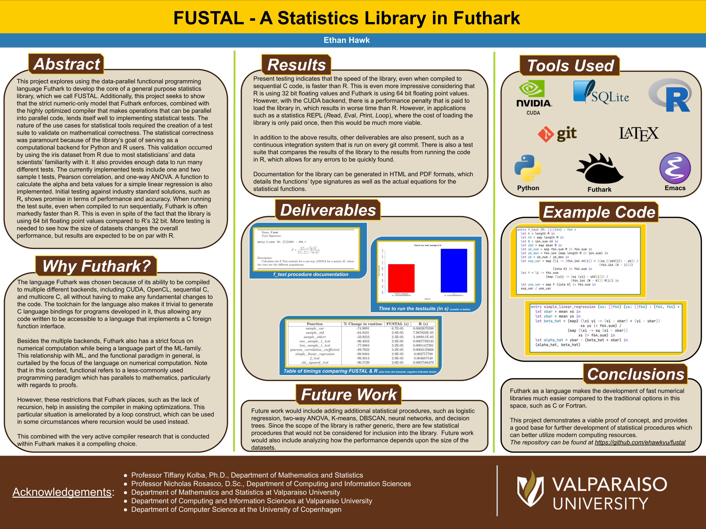

:DATE 2023
:TITLE FUSTAL
# FUSTAL

**FUSTAL** is a statistics library that I wrote as my Senior year project
for my data science major at Valparaiso Univeristy. It is written entirely
in [futhark](https://futhark-lang.org/), which is a functional programming
language designed for number crunching. This library also includes a built
in test-suite comparing it's results against R aswell as documentation.

## Motivation

One of the key motivators for this project was to be able to demonstrate
that C, C++, and Fortran are not *required* for this kind of computing,
since most popular statistical library backend are written in one of these
three languages. There are exceptions to this, such as Haskell's
[statistics](https://hackage.haskell.org/package/statistics) library, but
generally speaking these libraries are written in low level languages.

This is typically the right call, since these languages don't suffer
from the high amounts of runtime overhead that other languages have.
However, Futhark presents a little wrinkle in this model since it is designed
not as an application language, but rather a library language, which allows
it to forgo some of the nicities of more general purpose languages like
Haskell, but in exchange allows you to compile your code to be used in
other languages using the C foreign function interface.

In addition to being a library focused language, futhark also allows you to
trivially compile your code for running on the GPU, with CUDA and OpenCL
serving as valid backends, with there being a potential for
[Vulkan](https://github.com/diku-dk/futhark/issues/1856) in the future.

## FUSTAL Itself

### Features

### Test-Suite

The test suite is divided into three parts: the python script, the
R script, and the shell script that computes the differences.

Admittedly, most of this could likley have been done in Python, however I
did not want to hurt the chances of R by using R through some kind of
library wrapper that would run the R code. So instead each test script
contains

### Results

FUSTAL generally outperforms R when it comes to the core statisitical
procedures. It is important to note that all of these benchmarks should
be taken with a few heavy grains of salt, since R does provide additional
information in addition to the running of statistical tests (such as the
p-value, etc).

## Poster

## More

